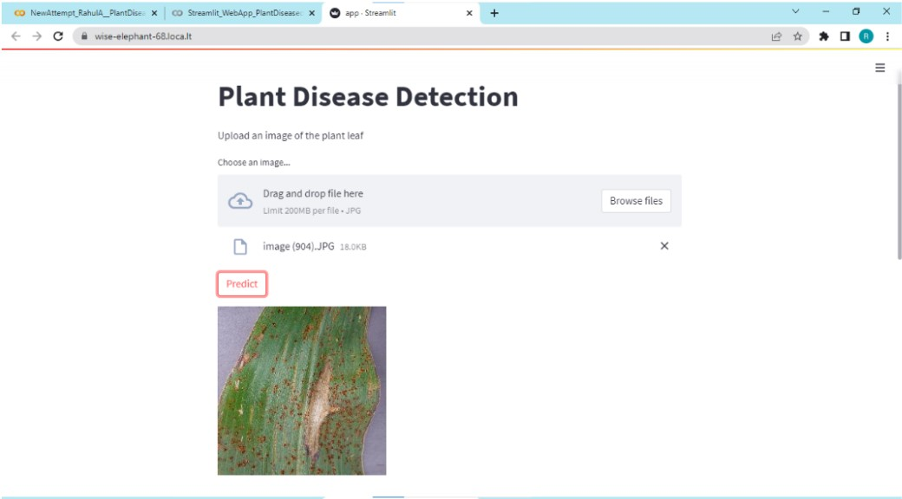
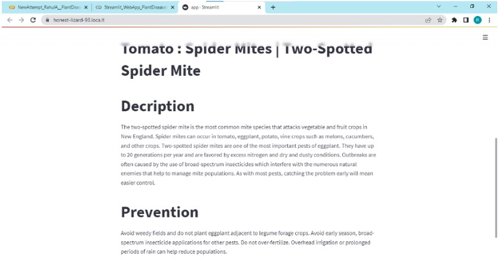

# Plant-Disease-Detection-using-CNN
Plant disease prediction is a web-based application that uses computer vision and neural networks to predict whether a plant is suffering from a disease. In order to detect and diagnose the plant infection/disease, leaf infection is diagnosed using image processing.

This model uses a Convolutional Neural Network to determine whether a plant is afflicted with a disease. It also provides a description about that particular disease and also suggests ways for preventing it. 

For the construction, training, and testing of this classification model, this system employs many layers and other hyperparameters. 
Tensorflow and keras are also majorly used in the project's development.
The data processing and image augmentation are done using the Keras deep-learning framework. 
Images of diverse plants, both diseased and healthy leaves, were included in the dataset used in this study. 
The dataset contains images of various plant leaves like Apple, Cherry, Corn, Strawberry, Grape, Orange, Peach, Pepper, Tomato and Potato.

# Output of our project:
 

